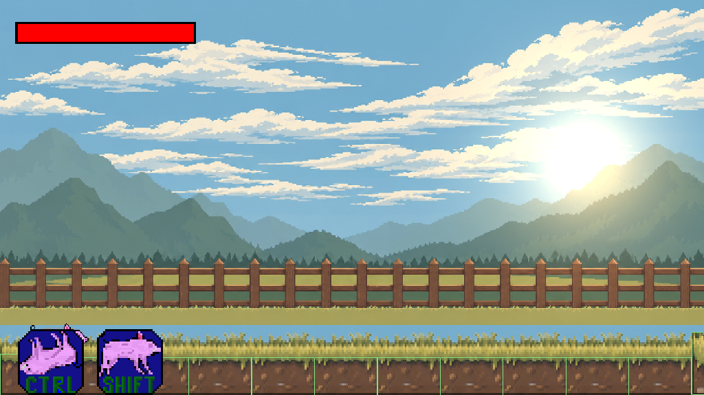
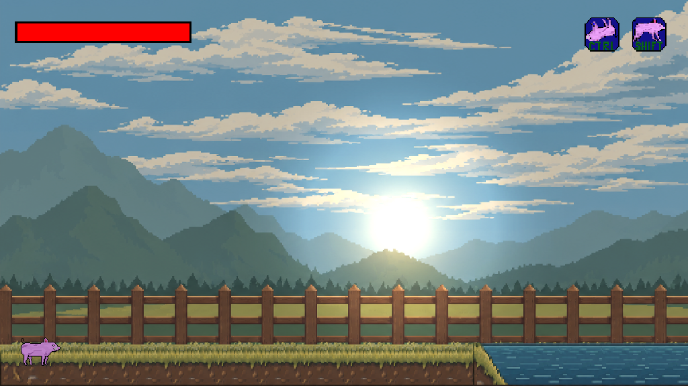

# Kamera och bakgrund

## Varför bilden såg fel ut

- `FitViewport(16, 9)` kombinerades med `camera.zoom = 0.7`: den synliga världen var bara 11,2 × 6,3 enheter. Även slutskärmarna ärvde förstoringen.
- Bakgrundens skala beräknades från samma kamerazoom, och hela bilden inklusive den blå remsan under gräset ritades. Bildens marklinje saknade koppling till Tiled-marken.
- Kameran följde spelarens Y direkt vid varje hopp.
- Box2DLights återställde hela fönstrets GL-viewport efter sitt framebufferpass. Spelvärlden återställde inte sin FitViewport varje bildruta. Detta bröt proportioner/letterboxing efter bland annat resize i det tidigare 640 × 480-fönstret.
- `setAmbientLight(amount)` skickade RGB=amount, alpha=1 till Box2DLights. Det betydde färgtillsats, inte den ljusstyrka metodens dokumentation utlovade.
- Förmågeikonerna täckte spelaren vid starten och fysikens debuglinjer ritades alltid.

## Hur det fungerar nu

`1 world unit = 32 Tiled-pixlar`. Terräng, Box2D och spelare behåller sina koordinater. Spelkameran är ortografisk, zoom 1, med en **fast 16 × 9-vy**. Standardfönstret är 1024 × 576. Andra proportioner får svarta kanter, utan att sträcka spelvärlden eller ändra hur mycket av banan som syns.

`SideScrollerCamera` håller ett eget följningstillstånd, mjukar ut rörelse med tidsbaserad exponentiell interpolation och ger högst 1,5 enheters framförhållning. Vanliga hopp ryms i en vertikal frizon; större höjdskillnader följs. Kameran och skakningen begränsas till kartan. Kartor mindre än vyn centreras. Skakningen matas aldrig tillbaka i följningsberäkningen.

`WorldBackground` ritas genom **samma kamera som terrängen**. Det befintliga motivet innehåller ett nära staket, så det är världsfast, utan parallax: staketet får inte glida relativt marken. Bildens proportioner bevaras och skalan bestäms av kartdata, inte fönstret. Den blå bottenremsan beskärs vid rendering. Originalfilen behöver inte ändras.

Bilden är inte sömlöst repeterbar. Varannan bildpanel speglas för att matcha kantpixlarna utan hårda skarvar; motivet blir därför symmetriskt vid panelskarvarna. Bildens blå översta pixelrad fortsätter uppåt vid höga hopp. För en mer varierad lång bana bör framtida grafik ha ett separat, sömlöst staket och separata himmel-/bergslager. Det är en grafisk vidareutveckling, inte ett krav för denna rendering.

Renderordning: tillämpa världens viewport → bakgrund → karta/projektiler/spelare → ljus i samma skärmyta → separat HUD-viewport → eventuell debugvy. F1 växlar både debugpanelen och fysiklinjerna.

## Inställningar i Tiled

Öppna **Map → Map Properties** för `assets/maps/testmap/map.tmx`:

| Egenskap | Typ | Värde | Betydelse |
|---|---|---:|---|
| `backgroundWorldWidth` | float | 20 | En bildpanels bredd i världsenheter, oberoende av kameran. |
| `backgroundGroundY` | float | 1 | Gräsets marklinje i världen; överkanten på nedersta Tiled-raden. |
| `backgroundGroundPixelY` | int | 730 | Marklinjens Y-pixel i originalbilden, räknat från toppen. |
| `backgroundCropBottom` | int | 774 | Första bortklippta bildraden; tar bort blå utfyllnad under gräset. |
| `backgroundSkyColor` | string | 70AEC7 | Grundfärg bakom bakgrunden. |
| `ambientLight` | float | 0.8 | Omgivningsljusstyrka, 0–1. |

Byter du bakgrundsbild behöver dess marklinje och beskärning anges igen. Ändra inte kamera eller PPM för att flytta bildens marklinje.

Kartan är 60 × 25 rutor, men Ground-lagret innehåller terräng bara i kolumn 0–26 och rad 22–24 (index från noll, uppifrån i Tiled). Resten är tomt. Bakgrundens målade gräs/staket är inte kollisionsmark och fyller inte luckor i banan.

## Verifiering

- `core:check` och `lwjgl3:classes` passerar med Java 17 / Gradle 9.2.1.
- Kameratestet kontrollerar startläge, hoppfrizon, snabb förflyttning, kartgränser, små kartor och konvergens vid 30 respektive 120 fps.
- Riktiga LWJGL3/Box2D/Box2DLights-bilder kontrollerades med mjukvaru-OpenGL: start, mitt i banan, högt ovanför banan, höger kartkant samt fönsterstorlekarna 1024 × 576, 800 × 600 och 1280 × 540. Testspelaren placerades på bestämda positioner för jämförbara bilder; detta ersätter inte en subjektiv speltest av kamerakänslan.
- Före/efterbilderna nedan kommer från spelets renderer, inte en illustration.

### Före

### Efter

## LibGDX-dokumentation

- [Viewports: FitViewport, resize och flera renderpass](https://libgdx.com/wiki/graphics/viewports)
- [Orthographic camera: världskoordinater och zoom](https://libgdx.com/wiki/graphics/2d/orthographic-camera)
- [Tile maps: kameran till OrthogonalTiledMapRenderer](https://libgdx.com/wiki/graphics/2d/tile-maps)

LibGDX beskriver kamera-/viewportmekaniken. Följningshastighet, frizon och framförhållning är spelanpassade designval här, inte en föreskriven LibGDX-standard.
